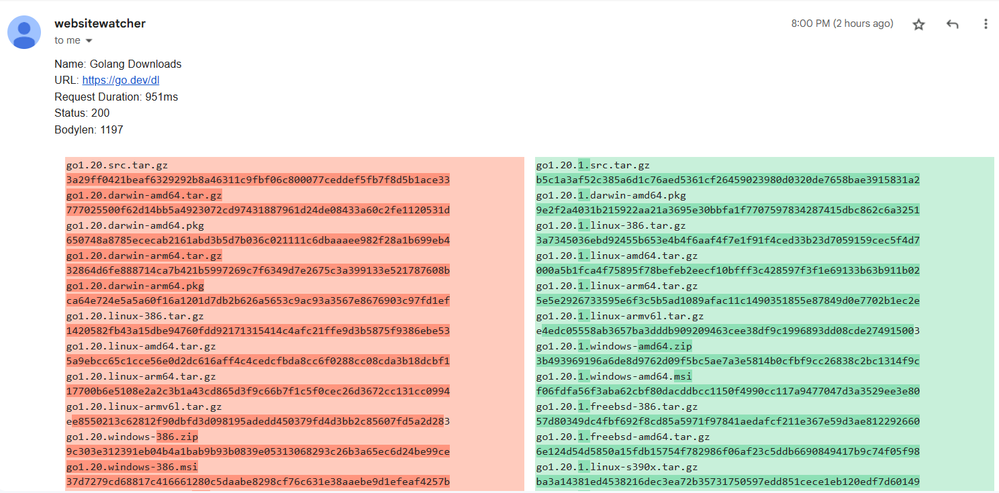

# websitewatcher

This tool can be used to monitor websites for changes and trigger an email with a diff to the previous version if they
differ.

It also supports extracting only a particular content from the website via regex and capture groups and also to replace
content based on a regex (for example to patch out CSRF tokens before comparing).

You can also trigger some webhooks when a website differs.

See the `config.json.sample` file for all possible configuration options.

## Usage

```text
./websitewatcher -config config.json
```

This will add all items from the config to the internal cron system and runs them on the defined intervals until the
program is stopped.
The first run of a newly added website does not trigger a diff email. The tool uses a local sqlite database to store the
previous results.

To run this tool as a service you can use [websitewatcher.service](websitewatcher.service). Copy it
to `/etc/systemd/system` and run `systemctl daemon-reload` followed by `systemctl enable websitewatcher.service`.

If an error occurs, it will be sent to the global defined `mail.to`. The `watches.additional_to` recipients are not
notified in this case.

You can also specify the parameter `-mode once` to run all checks immediately after each other without the cron mode. This can be used in a kubernetes setup to run this as a cron job. If an error occurs, the binary will exit with exit code 1.

### Example Screenshot of a diff E-Mail



## Config Options

| Option                             | Description                                                                                                                                                                                                                                                        |
| ---------------------------------- | ------------------------------------------------------------------------------------------------------------------------------------------------------------------------------------------------------------------------------------------------------------------ |
| mail.server                        | Mailserver to use                                                                                                                                                                                                                                                  |
| mail.port                          | port of the mailserver                                                                                                                                                                                                                                             |
| mail.from.name                     | the from name on sent emails                                                                                                                                                                                                                                       |
| mail.from.mail                     | the from email address on sent emails                                                                                                                                                                                                                              |
| mail.to                            | array of global receipients. these addresses are included on every watch                                                                                                                                                                                           |
| mail.skiptls                       | no TLS certificate checks on connecting to mailserver                                                                                                                                                                                                              |
| mail.tls                           | use tls when connecting to the mailserver                                                                                                                                                                                                                          |
| mail.starttls                      | use starttls when connecting to the mailserver                                                                                                                                                                                                                     |
| mail.user                          | smtp username, empty on no authentication                                                                                                                                                                                                                          |
| mail.password                      | smtp password                                                                                                                                                                                                                                                      |
| mail.retries                       | how often to retry sending emails                                                                                                                                                                                                                                  |
| mail.timeout                       | timeout for sending emails                                                                                                                                                                                                                                         |
| timeout                            | timeout for http requests                                                                                                                                                                                                                                          |
| retry.count                        | number of retries on http errors                                                                                                                                                                                                                                   |
| retry.delay                        | time to sleep between retries                                                                                                                                                                                                                                      |
| database                           | filename of the database                                                                                                                                                                                                                                           |
| no_errormail_on_statuscode         | if we get this status code after all retries do not send an error email                                                                                                                                                                                            |
| useragent                          | useragent header to use for outgoing http requests                                                                                                                                                                                                                 |
| retry_on_match                     | global setting of strings to retry request up to retry.count if the response body matches the provided regex                                                                                                                                                       |
| location                           | a valid location string. Shown times will be rendered in this timezone. Defaults to UTC if empty                                                                                                                                                                   |
| proxy.url                          | Use an http proxy for outgoing requests. The http_proxy, https_proxy and no_proxy env variables are respected, but you can also set it via config                                                                                                                  |
| proxy.username                     | Username to use if the proxy requires authentication                                                                                                                                                                                                               |
| proxy.password                     | Password used for authentication against the proxy                                                                                                                                                                                                                 |
| proxy.noproxy                      | NO_PROXY content. See the NoProxy comment [on this site](https://pkg.go.dev/golang.org/x/net/http/httpproxy) for the needed syntax                                                                                                                                 |
| watches.name                       | friendly name of the watch                                                                                                                                                                                                                                         |
| watches.cron                       | how often to run this check in cron format. See [https://crontab.guru/](https://crontab.guru/) or the [golang cron library docs](https://pkg.go.dev/github.com/go-co-op/gocron/v2#CronJob) for examples. Defaults to `@hourly` if not set.                         |
| watches.url                        | the url to check                                                                                                                                                                                                                                                   |
| watches.description                | an optional description of the watch                                                                                                                                                                                                                               |
| watches.method                     | http method to use. Defaults to GET                                                                                                                                                                                                                                |
| watches.body                       | optional body to send with the request. Don't forget to set a Content-Type header via watcher.header if needed                                                                                                                                                     |
| watches.additional_to              | array of additional emails for this watch. The email will be sent to the global ones and this list                                                                                                                                                                 |
| watches.no_errormail_on_statuscode | additional http errors to ignore when sending error emails. The global option is merged with this one                                                                                                                                                              |
| watches.header                     | additional http headers to add                                                                                                                                                                                                                                     |
| watches.disabled                   | used to disable a watch                                                                                                                                                                                                                                            |
| watches.pattern                    | the pattern is a regex and must contain one match group. The group is used as the body. This is used to extract the relevant body in big html sites. If left empty the whole body is used                                                                          |
| watches.replaces.pattern           | regex pattern to match in the body                                                                                                                                                                                                                                 |
| watches.replaces.replace_with      | replacement string for the regex match                                                                                                                                                                                                                             |
| watches.retry_on_match             | retry request up to retry.count if the response body matches the provided regex                                                                                                                                                                                    |
| watches.skip_soft_error_patterns   | if set there are no checks for soft errors like default error pages                                                                                                                                                                                                |
| watches.jq                         | apply a jq filter to the response body before applying replaces. Example: `.result &#124; .[] &#124; select(.name=="test")`                                                                                                                                        |
| watches.extract_body               | automatically extract the body tag (including the <body> and </body> elements) from the result before matching. This can be used to ignore everything in head that changes constantly. Be aware that this parses the HTML body and will error out on invalid html. |
| watches.useragent                  | set a custom user agent for this watch only                                                                                                                                                                                                                        |
| watches.remove_empty_lines         | automatically replace double newlines with a single newline after all replaces. Used to clean up output.                                                                                                                                                           |
| watches.trim_whitespace            | automatically replace leading and trailing whitespaces after all replaces. Used to clean up output. Runs after remove_empty_lines.                                                                                                                                 |
| watches.webhooks                   | an array of webhooks to call when a website differs                                                                                                                                                                                                                |
| watches.webhooks.url               | a url to send a webhook to if a website differs                                                                                                                                                                                                                    |
| watches.webhooks.header            | additional headers to set on the webhook                                                                                                                                                                                                                           |
| watches.webhooks.method            | GET POST PUT PATCH or DELETE. If it's POST, PUT or PATCH the diff is encoded as json and send in the body                                                                                                                                                          |
| watches.webhooks.useragent         | Custom useragent to set on this webhook. Uses the default if left empty                                                                                                                                                                                            |

## Example

### HTML Diffing

In this example we will monitor [https://go.dev/dl](https://go.dev/dl) for new versions.

As we are only interested in the latest version, we use the global `pattern` to extract the content we want. To play
with the regexes head over to [https://regex101.com/](https://regex101.com/) and select `go` on the left hand side. Also
check the needed modifiers like g, m, s and so on. To include the modifiers in the regex you can prepend it like `(?s)`.
Also be sure to escape your regex in the JSON (double quotes and backslashes).

After the body is extracted we clean up the content by removing the content we are not interested part by part. The last
2 `replace` sections remove trailing and leading spaces and double newlines.

The resulting content (see below) is then checked against the last stored version every time the job runs. To test your
config you can run `./websitewatcher -config config.json -debug -dry-run` which will print out the results after each
replace, so it's easier to debug faulty regexes.

```json
{
  "mail": {
    "server": "in-v3.mailjet.coml",
    "port": 587,
    "from": {
      "name": "websitewatcher",
      "mail": "websitewatcher@mydomain.com"
    },
    "to": ["email@example.com"],
    "skiptls": false,
    "user": "user",
    "password": "pass"
  },
  "timeout": "60s",
  "retry": {
    "count": 1
  },
  "parallel_checks": 5,
  "database": "db.sqlite3",
  "useragent": "Mozilla/5.0 (Windows NT 10.0; Win64; x64) AppleWebKit/537.36 (KHTML, like Gecko) Chrome/102.0.5005.63 Safari/537.36 Edg/102.0.1245.33",
  "watches": [
    {
      "name": "Golang Downloads",
      "url": "https://go.dev/dl",
      "additional_to": ["person@example.com"],
      "pattern": "(?s)<table class=\"downloadtable\">(.+?)</table>",
      "trim_whitespace": true,
      "remove_empty_lines": true,
      "replaces": [
        {
          "pattern": "(?s)<thead>.+?</thead>",
          "replace_with": ""
        },
        {
          "pattern": "(?s)<th.*?>.+?</th>",
          "replace_with": ""
        },
        {
          "pattern": "(?s)<td>(Source|Archive|Installer|\\d+MB|Linux|Windows|macOS|FreeBSD|ARMv6|ARM64|ppc64le|x86|x86-64|s390x)</td>",
          "replace_with": ""
        },
        {
          "pattern": "<td.*?>",
          "replace_with": ""
        },
        {
          "pattern": "</td>",
          "replace_with": ""
        },
        {
          "pattern": "<tr.*?>",
          "replace_with": ""
        },
        {
          "pattern": "</tr>",
          "replace_with": ""
        },
        {
          "pattern": "<tt>",
          "replace_with": ""
        },
        {
          "pattern": "</tt>",
          "replace_with": ""
        },
        {
          "pattern": "<a class=\"download\" href=\".+?\">",
          "replace_with": ""
        },
        {
          "pattern": "</a>",
          "replace_with": ""
        }
      ]
    }
  ]
}
```

This would produce (as of go version 1.20) the following cleaned up output:

```text
go1.20.src.tar.gz
3a29ff0421beaf6329292b8a46311c9fbf06c800077ceddef5fb7f8d5b1ace33
go1.20.darwin-amd64.tar.gz
777025500f62d14bb5a4923072cd97431887961d24de08433a60c2fe1120531d
go1.20.darwin-amd64.pkg
650748a8785ececab2161abd3b5d7b036c021111c6dbaaaee982f28a1b699eb4
go1.20.darwin-arm64.tar.gz
32864d6fe888714ca7b421b5997269c7f6349d7e2675c3a399133e521787608b
go1.20.darwin-arm64.pkg
ca64e724e5a5a60f16a1201d7db2b626a5653c9ac93a3567e8676903c97fd1ef
go1.20.linux-386.tar.gz
1420582fb43a15dbe94760fdd92171315414c4afc21ffe9d3b5875f9386ebe53
go1.20.linux-amd64.tar.gz
5a9ebcc65c1cce56e0d2dc616aff4c4cedcfbda8cc6f0288cc08cda3b18dcbf1
go1.20.linux-arm64.tar.gz
17700b6e5108e2a2c3b1a43cd865d3f9c66b7f1c5f0cec26d3672cc131cc0994
go1.20.linux-armv6l.tar.gz
ee8550213c62812f90dbfd3d098195adedd450379fd4d3bb2c85607fd5a2d283
go1.20.windows-386.zip
9c303e312391eb04b4a1bab9b93b0839e05313068293c26b3a65ec6d24be99ce
go1.20.windows-386.msi
37d7279cd68817c416661280c5daabe8298cf76c631e38aaebe9d1efeaf4257b
go1.20.windows-amd64.zip
e8f6d8bbcf3df58d2ba29818e13b04c2e42ba2e4d90d580720b21c34d10bbf68
go1.20.windows-amd64.msi
179ec1b55d3c1b014595a72fc5f7f59d7c00f9732cc227b47dfe13e6cc633c7c
go1.20.freebsd-386.tar.gz
2f3c68213fa785d0ebfa4e50de5ea8f4baf5d9c12f5783c59e1ee370e35755ae
go1.20.freebsd-amd64.tar.gz
8c5ccff790dda019e070a6a13745aba0c1ea0e3d47076bacf9fb1e0b34cc731f
go1.20.linux-ppc64le.tar.gz
bccbf89c83e0aab2911e57217159bf0fc49bb07c6eebd2c23ae30af18fc5368b
go1.20.linux-s390x.tar.gz
4460deffbc01fe5f31fe226d296e366c0d6059b280743aea49bf81ab62ab8be8
go1.20.windows-arm64.zip
2421b2ade9b68517f962f0ea4fb27b68b5321b334fb1b353de25be5b2ee90cba
go1.20.windows-arm64.msi
3b520f5ef57fb8e0032eeeec5da1665644daa6499234412e91ab1eb44b05881a
```

### JSON filtering

We can also get the latest download as JSON by calling [https://go.dev/dl/?mode=json](https://go.dev/dl/?mode=json). Websitewatcher can filter
JSON output using JQ syntax to reduce the output.

You can test your filter using the command line. This for example extracts the latest stable versions of go:

```bash
curl "https://go.dev/dl/?mode=json" | jq '.[] | .version'
```

You can then include this filter in the config.

```json
{
  "mail": {
    "server": "in-v3.mailjet.coml",
    "port": 587,
    "from": {
      "name": "websitewatcher",
      "mail": "websitewatcher@mydomain.com"
    },
    "to": ["email@example.com"],
    "skiptls": false,
    "user": "user",
    "password": "pass"
  },
  "timeout": "60s",
  "retry": {
    "count": 1
  },
  "parallel_checks": 5,
  "database": "db.sqlite3",
  "useragent": "Mozilla/5.0 (Windows NT 10.0; Win64; x64) AppleWebKit/537.36 (KHTML, like Gecko) Chrome/102.0.5005.63 Safari/537.36 Edg/102.0.1245.33",
  "watches": [
    {
      "name": "Golang Downloads",
      "url": "https://go.dev/dl/?mode=json",
      "jq": ".[] | .version",
      "additional_to": ["person@example.com"]
    }
  ]
}
```

Example run with debug output enabled:

```text
INFO <database/database.go:105> applied 1 database migrations
INFO <database/database.go:112> database setup completed version=20240924100627
INFO <v2@v2.12.4/scheduler.go:169> gocron: new scheduler created
DEBU <websitewatcher/main.go:178> added task id=20d4d1a1-920f-44df-89d2-916cc472a496 name="Golang Downloads" schedule=@hourly
DEBU <v2@v2.12.4/scheduler.go:485> gocron: scheduler starting
INFO <v2@v2.12.4/scheduler.go:523> gocron: scheduler started
DEBU <v2@v2.12.4/executor.go:79> gocron: executor started
DEBU <websitewatcher/main.go:196> running new job name="Golang Downloads"
DEBU <v2@v2.12.4/executor.go:314> gocron: singletonModeRunner starting name=singleton-20d4d1a1-920f-44df-89d2-916cc472a496
INFO <watch/watch.go:181> checking watch name="Golang Downloads" try=1
INFO <websitewatcher/main.go:272> new website detected, not comparing name="Golang Downloads"
DEBU <websitewatcher/main.go:273> website content
  content=
  │ [
  │   "go1.23.4",
  │   "go1.22.10"
  │ ]
```
