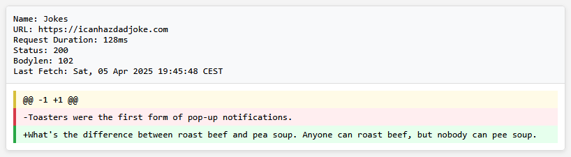

# websitewatcher

This tool can be used to monitor websites for changes and trigger an email with a diff to the previous version if they
differ.

It also supports extracting only a particular content from the website via regex and capture groups and also to replace
content based on a regex (for example to patch out CSRF tokens before comparing).

You can also trigger some webhooks when a website differs.

See the `config.json.sample` file for all possible configuration options.

## Usage

```text
./websitewatcher -config config.json
```

This will add all items from the config to the internal cron system and runs them on the defined intervals until the
program is stopped.
The first run of a newly added website does not trigger a diff email. The tool uses a local sqlite database to store the
previous results.

To run this tool as a service you can use [websitewatcher.service](websitewatcher.service). Copy it
to `/etc/systemd/system` and run `systemctl daemon-reload` followed by `systemctl enable websitewatcher.service`.

If an error occurs, it will be sent to the global defined `mail.to`. The `watches.additional_to` recipients are not
notified in this case.

You can also specify the parameter `-mode once` to run all checks immediately after each other without the cron mode. This can be used in a kubernetes setup to run this as a cron job. If an error occurs, the binary will exit with exit code 1.

## (my) usecases

Here is a list of my current usecases

- Checking domain availability via the gandi API
- Checking for motherboard driver and bios updates
- Checking for new releases of software
- Monitoring specific docs to see if something changes, for example the "Deprecated Windows Features" page
- Checking various other JSON apis
- Checking for router updates
- Checking DDOS targets and filter them on the targets that interest you
- Various RSS feeds
- Monitor sites on the TOR network using a TOR HTTP proxy ([https://github.com/firefart/zwiebelproxy](https://github.com/firefart/zwiebelproxy))

### Example Screenshot of a diff E-Mail



## Example

### HTML Diffing

In this example we will monitor [https://go.dev/dl](https://go.dev/dl) for new versions.

As we are only interested in the latest version, we use the global `pattern` to extract the content we want. To play
with the regexes head over to [https://regex101.com/](https://regex101.com/) and select `go` on the left hand side. Also
check the needed modifiers like g, m, s and so on. To include the modifiers in the regex you can prepend it like `(?s)`.
Also be sure to escape your regex in the JSON (double quotes and backslashes).

After the body is extracted we clean up the content by removing the content we are not interested part by part. The last
2 `replace` sections remove trailing and leading spaces and double newlines.

The resulting content (see below) is then checked against the last stored version every time the job runs. To test your
config you can run `./websitewatcher -config config.json -debug -dry-run` which will print out the results after each
replace, so it's easier to debug faulty regexes.

```json
{
  "mail": {
    "server": "in-v3.mailjet.coml",
    "port": 587,
    "from": {
      "name": "websitewatcher",
      "mail": "websitewatcher@mydomain.com"
    },
    "to": ["email@example.com"],
    "skiptls": false,
    "user": "user",
    "password": "pass"
  },
  "timeout": "60s",
  "retry": {
    "count": 1
  },
  "parallel_checks": 5,
  "database": "db.sqlite3",
  "useragent": "Mozilla/5.0 (Windows NT 10.0; Win64; x64) AppleWebKit/537.36 (KHTML, like Gecko) Chrome/102.0.5005.63 Safari/537.36 Edg/102.0.1245.33",
  "watches": [
    {
      "name": "Golang Downloads",
      "url": "https://go.dev/dl",
      "additional_to": ["person@example.com"],
      "pattern": "table.downloadtable",
      "html2text": true,
      "trim_whitespace": true,
      "remove_empty_lines": true
    }
  ]
}
```

This would produce (as of go version 1.25) the following cleaned up output:

```text
File name
Kind
OS
Arch
Size
SHA256 Checksum
go1.25.0.src.tar.gz
Source
30MB
4bd01e91297207bfa450ea40d4d5a93b1b531a5e438473b2a06e18e077227225
go1.25.0.darwin-amd64.tar.gz
Archive
macOS
x86-64
58MB
5bd60e823037062c2307c71e8111809865116714d6f6b410597cf5075dfd80ef
go1.25.0.darwin-amd64.pkg
Installer
macOS
x86-64
59MB
95e836238bcf8f9a71bffea43344cbd35ee1f16db3aaced2f98dbac045d102db
go1.25.0.darwin-arm64.tar.gz
Archive
macOS
ARM64
55MB
[..snip..]
go1.25.0.plan9-386.tar.gz
Archive
plan9
x86
54MB
46f8cef02086cf04bf186c5912776b56535178d4cb319cd19c9fdbdd29231986
go1.25.0.plan9-amd64.tar.gz
Archive
plan9
x86-64
56MB
29b34391d84095e44608a228f63f2f88113a37b74a79781353ec043dfbcb427b
go1.25.0.plan9-arm.tar.gz
Archive
plan9
arm
54MB
0a047107d13ebe7943aaa6d54b1d7bbd2e45e68ce449b52915a818da715799c2
go1.25.0.solaris-amd64.tar.gz
Archive
solaris
x86-64
56MB
9977f9e4351984364a3b2b78f8b88bfd1d339812356d5237678514594b7d3611
go1.25.0.windows-arm64.zip
Archive
Windows
ARM64
62MB
27bab004c72b3d7bd05a69b6ec0fc54a309b4b78cc569dd963d8b3ec28bfdb8c
go1.25.0.windows-arm64.msi
Installer
Windows
ARM64
52MB
357d030b217ff68e700b6cfc56097bc21ad493bb45b79733a052d112f5031ed9
```

### JSON filtering

We can also get the latest download as JSON by calling [https://go.dev/dl/?mode=json](https://go.dev/dl/?mode=json). Websitewatcher can filter
JSON output using JQ syntax to reduce the output.

You can test your filter using the command line. This for example extracts the latest stable versions of go:

```bash
curl "https://go.dev/dl/?mode=json" | jq '.[] | .version'
```

You can then include this filter in the config.

```json
{
  "mail": {
    "server": "in-v3.mailjet.coml",
    "port": 587,
    "from": {
      "name": "websitewatcher",
      "mail": "websitewatcher@mydomain.com"
    },
    "to": ["email@example.com"],
    "skiptls": false,
    "user": "user",
    "password": "pass"
  },
  "timeout": "60s",
  "retry": {
    "count": 1
  },
  "parallel_checks": 5,
  "database": "db.sqlite3",
  "useragent": "Mozilla/5.0 (Windows NT 10.0; Win64; x64) AppleWebKit/537.36 (KHTML, like Gecko) Chrome/102.0.5005.63 Safari/537.36 Edg/102.0.1245.33",
  "watches": [
    {
      "name": "Golang Downloads",
      "url": "https://go.dev/dl/?mode=json",
      "jq": ".[] | .version",
      "additional_to": ["person@example.com"]
    }
  ]
}
```

Example run with debug output enabled:

```text
INFO <database/database.go:105> applied 1 database migrations
INFO <database/database.go:112> database setup completed version=20240924100627
INFO <v2@v2.12.4/scheduler.go:169> gocron: new scheduler created
DEBU <websitewatcher/main.go:178> added task id=20d4d1a1-920f-44df-89d2-916cc472a496 name="Golang Downloads" schedule=@hourly
DEBU <v2@v2.12.4/scheduler.go:485> gocron: scheduler starting
INFO <v2@v2.12.4/scheduler.go:523> gocron: scheduler started
DEBU <v2@v2.12.4/executor.go:79> gocron: executor started
DEBU <websitewatcher/main.go:196> running new job name="Golang Downloads"
DEBU <v2@v2.12.4/executor.go:314> gocron: singletonModeRunner starting name=singleton-20d4d1a1-920f-44df-89d2-916cc472a496
INFO <watch/watch.go:181> checking watch name="Golang Downloads" try=1
INFO <websitewatcher/main.go:272> new website detected, not comparing name="Golang Downloads"
DEBU <websitewatcher/main.go:273> website content
  content=
  │ [
  │   "go1.23.4",
  │   "go1.22.10"
  │ ]
```

### Next.js page

Here is an example of fetching a Next.js page like the Github Enterprise Server Changelog

```json
{
  "name": "GHE Releases",
  "cron": "@daily",
  "url": "https://docs.github.com/en/enterprise-server/admin/release-notes",
  "pattern": "#__NEXT_DATA__",
  "jq": ".props.pageProps.ghesContext"
}
```

### RSS

```json
{
  "name": "Github Changelog",
  "cron": "@daily",
  "parse_rss": true,
  "url": "https://github.blog/changelog/feed/"
}
```

### Deprecated Windows Features

```json
{
  "name": "Deprecated Windows Features",
  "cron": "@daily",
  "url": "https://learn.microsoft.com/en-us/windows/whats-new/deprecated-features",
  "pattern": "div.content:nth-child(6)",
  "html2text": true
}
```

### Domain Availability

```json
{
  "name": "Domain Availability",
  "cron": "@daily",
  "url": "https://api.gandi.net/v5/domain/check?currency=EUR&name=MY-DOMAIN.COM",
  "header": {
    "Authorization": "Apikey {{ gandi_api_key }}"
  },
  "retry_on_match": [
    "\"status\":\"pending\"",
    "{\"grid\":\"A\",\"currency\":\"EUR\"}"
  ]
}
```

## Config Options

| Option                             | Description                                                                                                                                                                                                                                                        |
| ---------------------------------- | ------------------------------------------------------------------------------------------------------------------------------------------------------------------------------------------------------------------------------------------------------------------ |
| mail.server                        | Mailserver to use                                                                                                                                                                                                                                                  |
| mail.port                          | port of the mailserver                                                                                                                                                                                                                                             |
| mail.from.name                     | the from name on sent emails                                                                                                                                                                                                                                       |
| mail.from.mail                     | the from email address on sent emails                                                                                                                                                                                                                              |
| mail.to                            | array of global receipients. these addresses are included on every watch                                                                                                                                                                                           |
| mail.skiptls                       | no TLS certificate checks on connecting to mailserver                                                                                                                                                                                                              |
| mail.tls                           | use tls when connecting to the mailserver                                                                                                                                                                                                                          |
| mail.starttls                      | use starttls when connecting to the mailserver                                                                                                                                                                                                                     |
| mail.user                          | smtp username, empty on no authentication                                                                                                                                                                                                                          |
| mail.password                      | smtp password                                                                                                                                                                                                                                                      |
| mail.retries                       | how often to retry sending emails                                                                                                                                                                                                                                  |
| mail.timeout                       | timeout for sending emails                                                                                                                                                                                                                                         |
| timeout                            | timeout for http requests                                                                                                                                                                                                                                          |
| retry.count                        | number of retries on http errors                                                                                                                                                                                                                                   |
| retry.delay                        | time to sleep between retries                                                                                                                                                                                                                                      |
| database                           | filename of the database                                                                                                                                                                                                                                           |
| no_errormail_on_statuscode         | if we get this status code after all retries do not send an error email                                                                                                                                                                                            |
| useragent                          | useragent header to use for outgoing http requests                                                                                                                                                                                                                 |
| retry_on_match                     | global setting of strings to retry request up to retry.count if the response body matches the provided regex                                                                                                                                                       |
| location                           | a valid location string. Shown times will be rendered in this timezone. Defaults to UTC if empty                                                                                                                                                                   |
| proxy.url                          | Use an http proxy for outgoing requests. The http_proxy, https_proxy and no_proxy env variables are respected, but you can also set it via config                                                                                                                  |
| proxy.username                     | Username to use if the proxy requires authentication                                                                                                                                                                                                               |
| proxy.password                     | Password used for authentication against the proxy                                                                                                                                                                                                                 |
| proxy.noproxy                      | NO_PROXY content. See the NoProxy comment [on this site](https://pkg.go.dev/golang.org/x/net/http/httpproxy) for the needed syntax                                                                                                                                 |
| watches.name                       | friendly name of the watch                                                                                                                                                                                                                                         |
| watches.cron                       | how often to run this check in cron format. See [https://crontab.guru/](https://crontab.guru/) or the [golang cron library docs](https://pkg.go.dev/github.com/go-co-op/gocron/v2#CronJob) for examples. Defaults to `@hourly` if not set.                         |
| watches.url                        | the url to check                                                                                                                                                                                                                                                   |
| watches.description                | an optional description of the watch                                                                                                                                                                                                                               |
| watches.method                     | http method to use. Defaults to GET                                                                                                                                                                                                                                |
| watches.body                       | optional body to send with the request. Don't forget to set a Content-Type header via watcher.header if needed                                                                                                                                                     |
| watches.additional_to              | array of additional emails for this watch. The email will be sent to the global ones and this list                                                                                                                                                                 |
| watches.no_errormail_on_statuscode | additional http errors to ignore when sending error emails. The global option is merged with this one                                                                                                                                                              |
| watches.header                     | additional http headers to add                                                                                                                                                                                                                                     |
| watches.disabled                   | used to disable a watch                                                                                                                                                                                                                                            |
| watches.pattern                    | the pattern is a css selector. The innerhtml of the match is used as a body in all further processing. This is used to extract the relevant body in big html sites. If left empty the whole body is used                                                           |
| watches.replaces.pattern           | regex pattern to match in the body                                                                                                                                                                                                                                 |
| watches.replaces.replace_with      | replacement string for the regex match                                                                                                                                                                                                                             |
| watches.retry_on_match             | retry request up to retry.count if the response body matches the provided regex                                                                                                                                                                                    |
| watches.skip_soft_error_patterns   | if set there are no checks for soft errors like default error pages                                                                                                                                                                                                |
| watches.jq                         | apply a jq filter to the response body before applying replaces. Example: `.result &#124; .[] &#124; select(.name=="test")`                                                                                                                                        |
| watches.extract_body               | automatically extract the body tag (including the <body> and </body> elements) from the result before matching. This can be used to ignore everything in head that changes constantly. Be aware that this parses the HTML body and will error out on invalid html. |
| watches.html2text                  | convert the html after applying the global `pattern` to plain text. This removes most of the html tags and also gets rid of style and script tags. Best paired with `extract_body`, `remove_empty_lines` and `trim_whitespace                                      |
| watches.useragent                  | set a custom user agent for this watch only                                                                                                                                                                                                                        |
| watches.remove_empty_lines         | automatically replace double newlines with a single newline after all replaces. Used to clean up output.                                                                                                                                                           |
| watches.trim_whitespace            | automatically replace leading and trailing whitespaces after all replaces. Used to clean up output. Runs after remove_empty_lines.                                                                                                                                 |
| watches.parse_rss                  | parse the content as a rss feed and print it in a nice string for diffs                                                                                                                                                                                            |
| watches.webhooks                   | an array of webhooks to call when a website differs                                                                                                                                                                                                                |
| watches.webhooks.url               | a url to send a webhook to if a website differs                                                                                                                                                                                                                    |
| watches.webhooks.header            | additional headers to set on the webhook                                                                                                                                                                                                                           |
| watches.webhooks.method            | GET POST PUT PATCH or DELETE. If it's POST, PUT or PATCH the diff is encoded as json and send in the body                                                                                                                                                          |
| watches.webhooks.useragent         | Custom useragent to set on this webhook. Uses the default if left empty                                                                                                                                                                                            |
